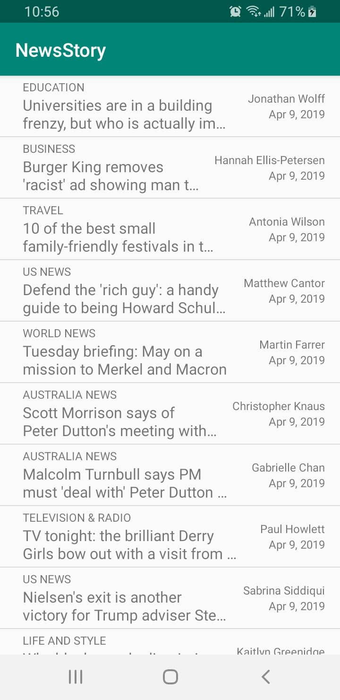

# Udacity Android Basics Nanodegree - NewsStory
This repository contains the NewsStory app from Udacity's Networking course. This app is created using Android Studio and developed in Java. The layout was designed in an XML document using a combination of RelativeLayouts, LinearLayouts, TextViews, ListViews,  SwipeRefreshLayouts, and a ProgressBar. This app connects to The Guardian API. The app queries the API to fetch the most recent news articles and parses the JSON responses returned from the API. The news articles are displayed in list, and clicking on a list item uses an intent to open the article in the user's browser. Network operations are executed using an AsyncTaskLoader, and a Uri builder is utilized to construct the URL string to pass into the loader's constructor.

## Overview
NewsStory is an app that allows users to see the latest news articles posted on The Guardian. The app allows the user to swipe down to refresh the news articles to retrieve the latest ones. Clicking on an item opens the article in a new tab on the phone's default Internet browser.

 
